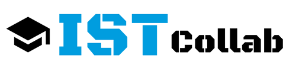

# ISTCollab

This project was designed and developed during the 2016 BreakingDev Hackathon, at Instituto Superior Técnico (IST), and won the A+ challenge.

The goal for this project was to build a web platform targeted to IST students, to promote extra-curricular activities among them and open the communication between Alameda and Taguspark campus students. 

- Students can post *project* ideas and find colleagues with the same *interests* and necessary *skills* to collaborate with them. Additionally, students can create *organizations* that post *events* (e.g. hackathons, workshops...), in which other students can participate.
- Students, projects, events and organizations have profiles.
- Students can create an account and start using immediately the platform and have access to all students' profiles interested in collaborations.

A possible new functionality could be a private chat between students.

## Technologies:
- **Platform:** Web
- **Framework:** Ruby on Rails
- **Frontend:** Bootstrap, HTML, CSS
- **Other resources:** Canva (for logo)

## Contributors:
- Cristiano Teixeira - [@crisgogim](https://github.com/crisgogim)
- Francisco Machado - [@CodeFiasco](https://github.com/CodeFiasco)
- Isabel Costa - [@isabelcosta](https://github.com/isabelcosta)
